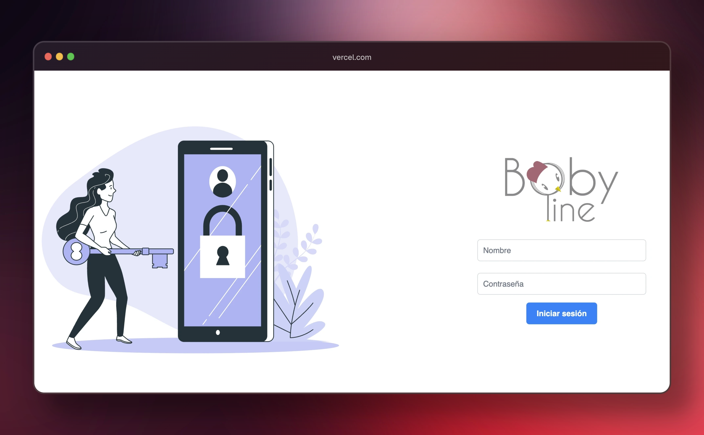
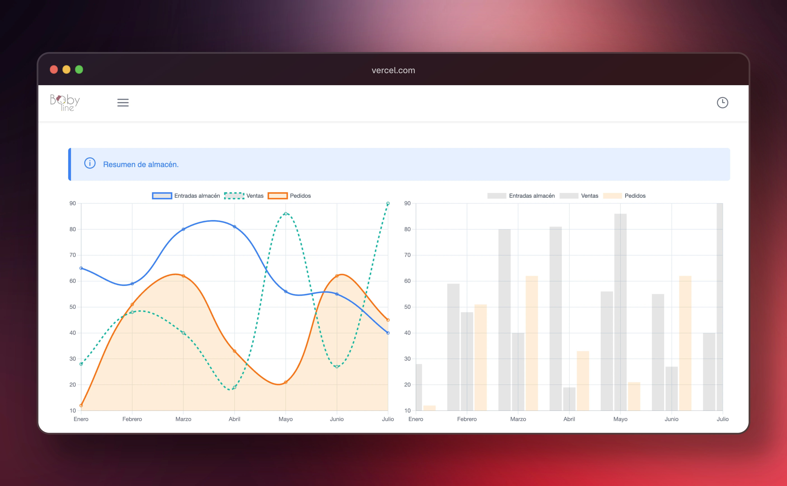
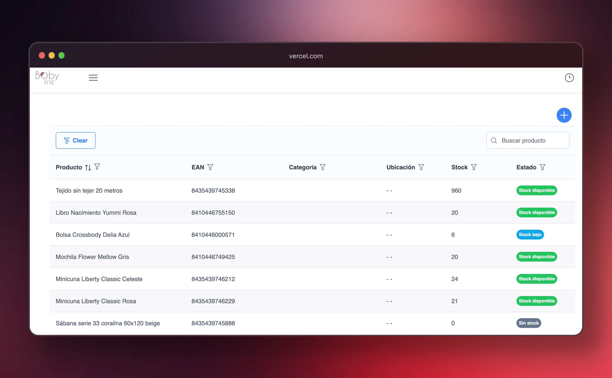
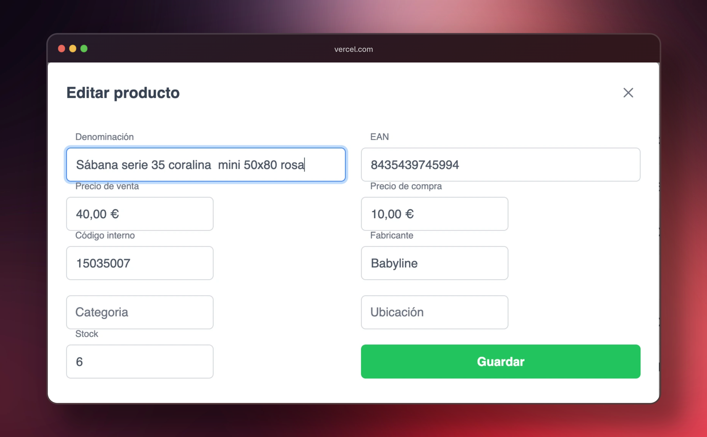
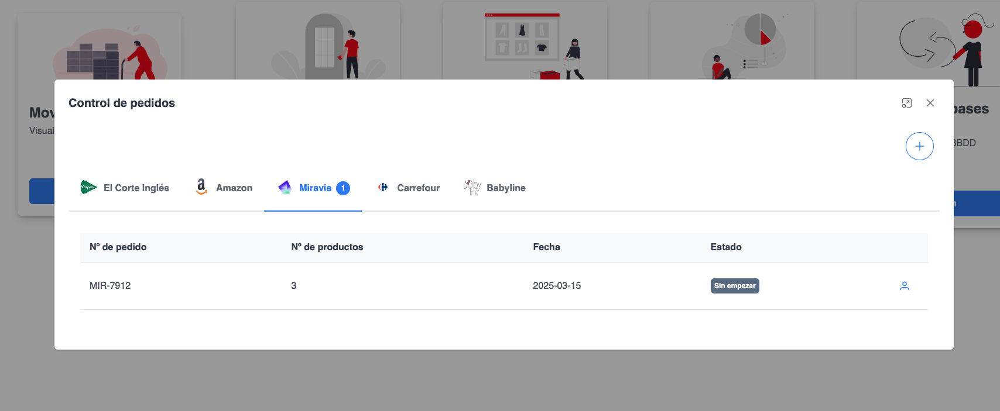
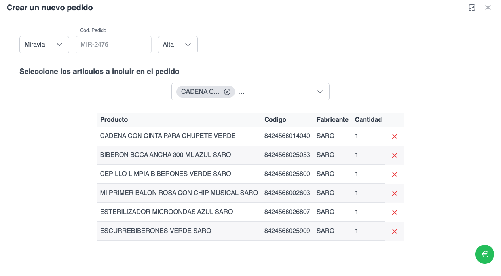
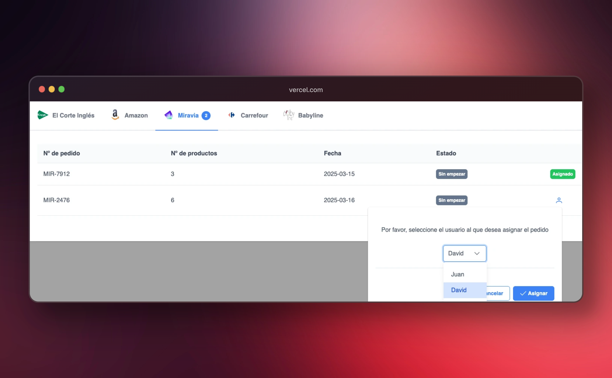
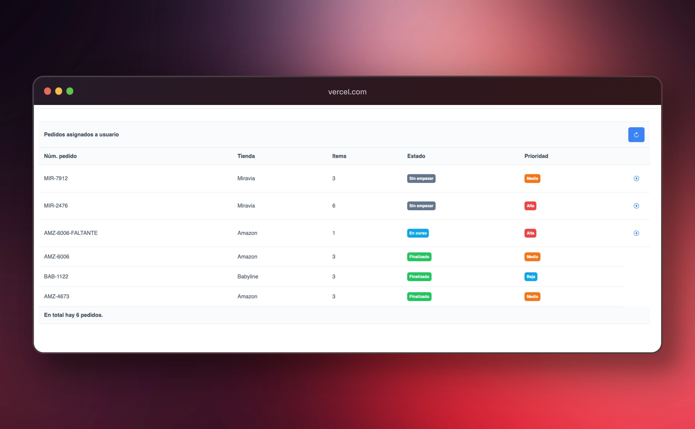
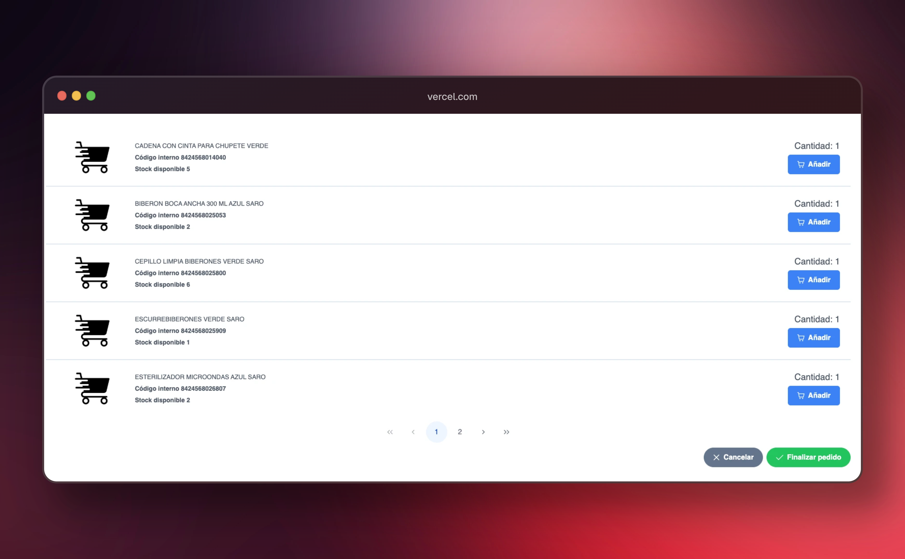
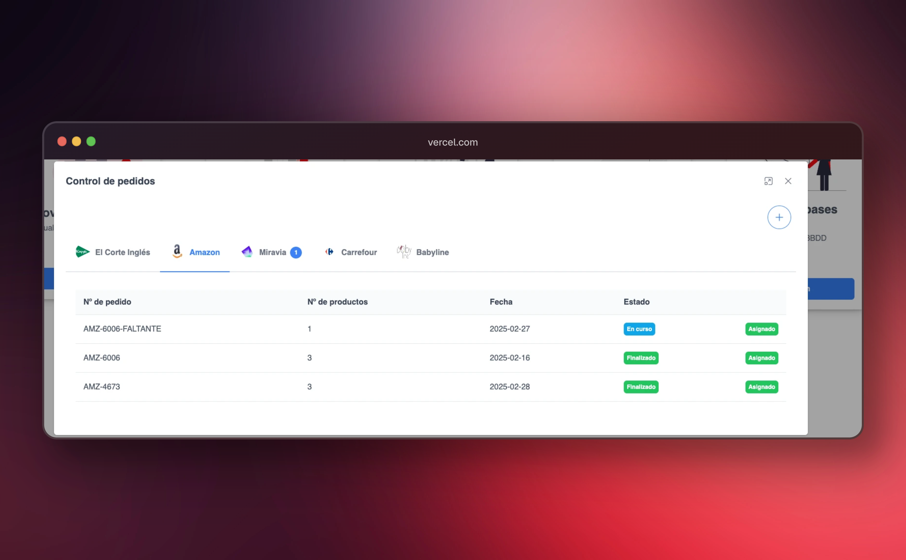

# Almacén Babyline.

Este proyecto ha sido creado para buscar un mejor control interno sobre un almacén, permitiendo crear nuevos usuarios, productos, pedidos y control de incidencias que se han podido crear en el transcurso de la realización de un pedido, o las excepciones propias de la base de datos.

Buscamos una optimización y control de los usuarios que interactuan con la aplicación, haciendo un seguimiento del estado de los productos, por cada edición, creación o eliminación del mismo.


## Tabla de Contenidos
- [Almacén Babyline.](#almacén-babyline)
  - [Tabla de Contenidos](#tabla-de-contenidos)
  - [Descripción](#descripción)
  - [Instalación](#instalación)

## Descripción

El proyecto, ha sido creado para mejorar, y optimizar una aplicación previa, facilitando caracteristicas que el cliente necesitaba en su dia a dia, y que en la aplicación actual no contaba.

Lo primero que se ha implementado en un Login, que accediendo con el nombre de usuario, y contraseña, podra acceder a la aplicación, y dependiendo de los permisos dados por el administrador, podrá tener acceso, o no, a determinadas funciones dentro de la aplicación.




 La descripción de este proyecto será desde la vista del administrador o del super usuario.

 Otra caracteristica importante que el cliente demanda, es un dashboard, en el que se pueda acceder a un resumen de las entradas en almacén, pedidos pendientes, realizados y enviados, así como la cantidad de ventas que han tenido, en periodos semestrales.

 

 Continuamos con la sección Productos, en la que se presenta una tabla con todos los productos incluidos en la base de datos, dando una información clara, concisa y visual del estado de cada pedido en el almacén.
 Una de las principales del grid principal de la aplicación, es permitir filtrar cada una de las columnas, además de una busqueda rápida sobre el propio grid.

 

   Desde este grid, podremos acceder a los métodos CRUD ya conocidos, con un formulario en el que se podrá dar de alta un nuevo producto, su ediciñon, incluso eliminarlo de la base de datos.Esta opción la encontramos en la parte superior derecha del grid.
   Mostramos el modal, que aparece al seleccionar, en este caso, una actualización de producto.
 

 

  Cada acción que se realice desde esta interfaz, sera reflejado en la sección Trazas, de la que hablaremos más adelante.

Pasamos a la función principal de la aplicación, que es el panel principal de administración. Desde este panel podremos cer los movimientos que se han hecho en el almacén, gestión de usuarios, gestión de pedidos, los reportes de las incidencias, y una opción específica, que es para sincronizar el contenido de diversas bases de datos.

Quizás, la opción más interesante de este menú, es la gestión de pedidos. Podremos ver los pedidos que estan asignados a diferentes tiendas, el estado del pedido, y la posibilidad de asignar el pedido a un empleado en concreto, que, al iniciar sesión lo encontrará en su seccion específica.

Este panel, muestra diferentes grids dependiendo de la tienda que tiene el pedido, y un contador en los header de cada uno de ellos, en los que se lleva un control visual y rapoido de aquellos pedidos que todavia están sin empezar.

Para este tutorial, realizaremos un alta de un nuevo pedido, para ver su funcionamiento.


 
 Este sería el modal principal de pedidos. Aqui podremos ver cada una de las tiendas con las que 
 trabaja el cliente, y por cada una de ellas, tendremos sus pedidos correspondientes.
 En este caso, tenemos seleccionado el tab de Miravia, en el que tiene una chip con el número 1, que indica que tenemos un pedido sin empezar.

 Vamos a crear un nuevo pedido, clickando en el botón + situado en la parte superior derecha.
 Crearemos uno más de Miravia, el código de pedido serå automático y la prioridad a nuestra elección.
 Incluiremos los productos en mediante el selector, y modificar su cantidad en el caso de que queramos aumentarla.

  Una vez creado, se procesa la contabilización. Informaremos al usuario de que se ha creado, se cierra el modal, y refrescamos el grid con el nuevo pedido incluido.

 

Procedemos a asignar el pedido al empleado elegido. 

 

Una vez asignado el pedido, el usuario seleccionado, tendra en su panel individual, todos aquellos pedidos que le han sido asignados.
En este caso, estamos haciendo la demo con el usuario David, por lo que si nos vamos al panel de Pedido, que se encuentra en el menú lateral, encontraremos el estado de pedidos asignados a este usuario.

 

Para los pedidos que están en un estado sin empezar, o en curso, nos aparece un botón para comenzar el pedido.
Se nos abrirá un modal, en el que se nos propone los productos para el pedido. En el caso de que exista más cantidad
solicitada, que la del stock, se propondrá un botón de reporte, para informar al administrador.
Además se creará un nuevo pedido, con el mismo codigo, concatenado con FALTANTE, con los productos que se deben de incluir faltantes en el anterior pedido relacionado.

 

Una ejemplo de caso de uso. Se creó un pedido, en el que faltaban productos. El pedido se terminó con incidencias, y automáticamente se creo un nuevo
pedido para terminar de finalizarlo.

 


## Instalación

Instrucciones para instalar y configurar el proyecto.

Este proyecto se ha desarrollado con Angular 17. 
Se ha hecho uso de las nuevas funcionalidades de Angular, como el control de estado, inyección de dependecias, y el uso de 
Standalone Components.

Para hacer una instalaciøn de este proyecto, basta con clonarlo en una carpeta local, abrir el directorio y consola 
instalar las dependencias de Node.

```bash
# Para instalar dependencias
npm install
```

Una vez instalado podremos levantar el proyecto, abriendo la carpeta raiz del proyecto, babyline-cliente y ejecutar el comando propio de Angular, o el comando de Node.

```bash
# Para levantar el proyecto mediante Angular.
ng serve -o

# Para levantar el proyecto con comando Node
npm start
```

Una vez levantado el proyecto, se accederá por la ruta por defecto que es /login.
Para poder interactuar con el proyecto, se deberá de configurar el Bakend, detallado en el repositorio correspondiente.

[Enlace a repositorio en GitHub para configuraciónn de Backend](https://github.com/DavidGRamiro/Backend-baby)

